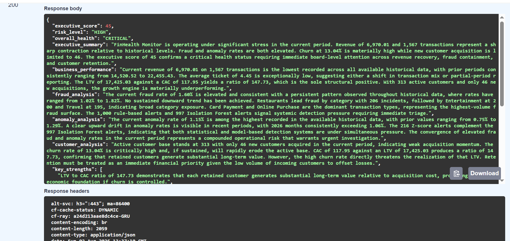
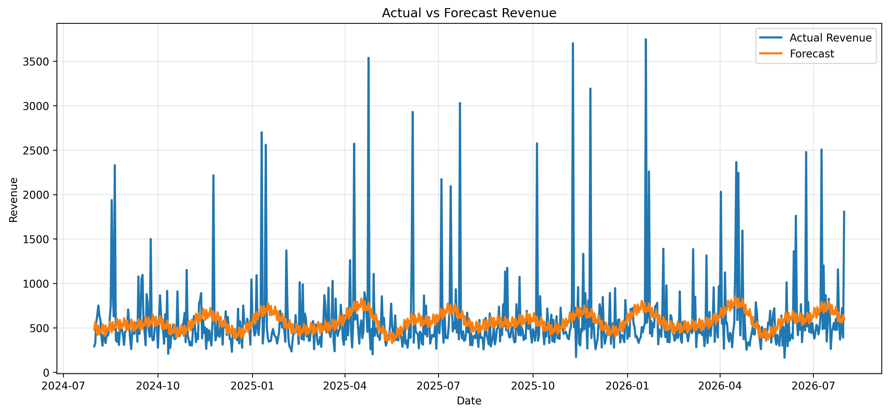

# FinHealth Monitor

Python • FastAPI • PostgreSQL • Scikit-learn • Prophet • Claude AI • Power BI


AI-powered financial intelligence platform that combines machine learning, SQL analytics, forecasting and Large Language Models to support executive decision-making.

---

## Live Demo

**Swagger API**
https://finhealth-monitor-api.onrender.com/docs

**GitHub**
https://github.com/robertaNicolle/finhealth_monitor

---

## Executive Summary



FinHealth Monitor simulates the analytical ecosystem of a modern fintech.

Instead of analysing isolated metrics, the platform integrates:

- Business Intelligence
- Machine Learning
- Forecasting
- Fraud Detection
- Customer Analytics
- Executive Reporting powered by Claude AI

The objective is to transform operational data into strategic business decisions.

---

# Project Highlights

- End-to-end Data Science project
- Synthetic fintech dataset (100,000+ transactions)
- Fraud Detection
- Isolation Forest anomaly detection
- Z-Score statistical monitoring
- Revenue forecasting using Prophet
- SQL Analytics
- REST API with FastAPI
- AI-generated executive reports
- Power BI Dashboard

---

# Business Problem

Financial institutions process thousands of transactions every day.

Business teams must simultaneously monitor:

- Revenue
- Customer acquisition
- Customer churn
- Fraud
- Operational anomalies
- Financial forecasting

Although these analyses usually exist independently, executives require a unified platform capable of converting raw data into strategic recommendations.

---

# Solution

FinHealth Monitor centralises business intelligence into a single analytical pipeline.

The project combines:

- PostgreSQL
- SQL Views
- Machine Learning
- Forecasting
- REST API
- Large Language Models

creating an end-to-end financial intelligence workflow.

---

# Architecture


---

# Dashboard


The Power BI dashboard provides executive visibility into:

- Revenue
- Fraud Rate
- Customer Metrics
- Forecasting
- Operational KPIs

---

# Machine Learning

## Fraud Detection

The project combines three complementary approaches:

- Business Rules
- Isolation Forest
- Z-Score

Using multiple detection strategies improves robustness compared to relying on a single model.

---

## Model Evaluation

### Isolation Forest

| Metric | Value |
|---------|-------|
| Precision | 0.02 |
| Recall | 0.01 |
| F1-score | 0.01 |

Although Isolation Forest successfully detects anomalies, the evaluation demonstrates why unsupervised methods should be combined with business rules instead of being used independently.

---

### Revenue Forecast

| Metric | Value |
|---------|-------|
| MAE | 227.68 |
| RMSE | 409.48 |
| MAPE | 39.69% |

Forecast generated using Facebook Prophet.



---

# REST API

The analytical services are exposed through FastAPI.

## Available Endpoints

| Endpoint | Description |
|-----------|-------------|
| /overview | Business overview |
| /customers | Customer analytics |
| /forecast | Revenue forecasting |
| /anomalies | Fraud & anomaly summary |
| /executive-summary | AI-generated executive report |
| /health | Health check |

Swagger UI:

https://finhealth-monitor-api.onrender.com/docs

---

# Technologies

| Layer | Technologies |
|---------|-------------|
| Programming | Python |
| Database | PostgreSQL |
| Data Analysis | Pandas, NumPy |
| Machine Learning | Scikit-learn |
| Forecasting | Prophet |
| API | FastAPI |
| ORM | SQLAlchemy |
| AI | Anthropic Claude |
| Dashboard | Power BI |

---

# Repository Structure

```text
finhealth_monitor/
│
├── api/
├── dashboard/
├── data/
├── docs/
├── notebooks/
├── scripts/
├── sql/
├── README.md
└── requirements.txt
```

---

# Getting Started

```bash
git clone https://github.com/robertaNicolle/finhealth_monitor.git

cd finhealth_monitor

pip install -r requirements.txt

cp .env.example .env

uvicorn api.main:app --reload
```

Open

```
http://127.0.0.1:8000/docs
```

---

# Future Improvements

- Real-time streaming
- Authentication
- CI/CD
- Docker
- Kubernetes deployment
- Model monitoring
- Automated retraining

---

# Author

## Roberta Soares

Data Science • Machine Learning • Artificial Intelligence

GitHub

https://github.com/robertaNicolle

LinkedIn

https://linkedin.com/in/roberta-soares-dev