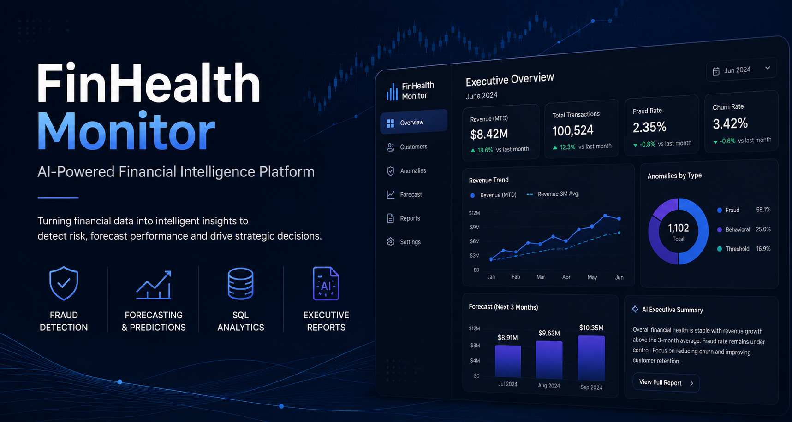
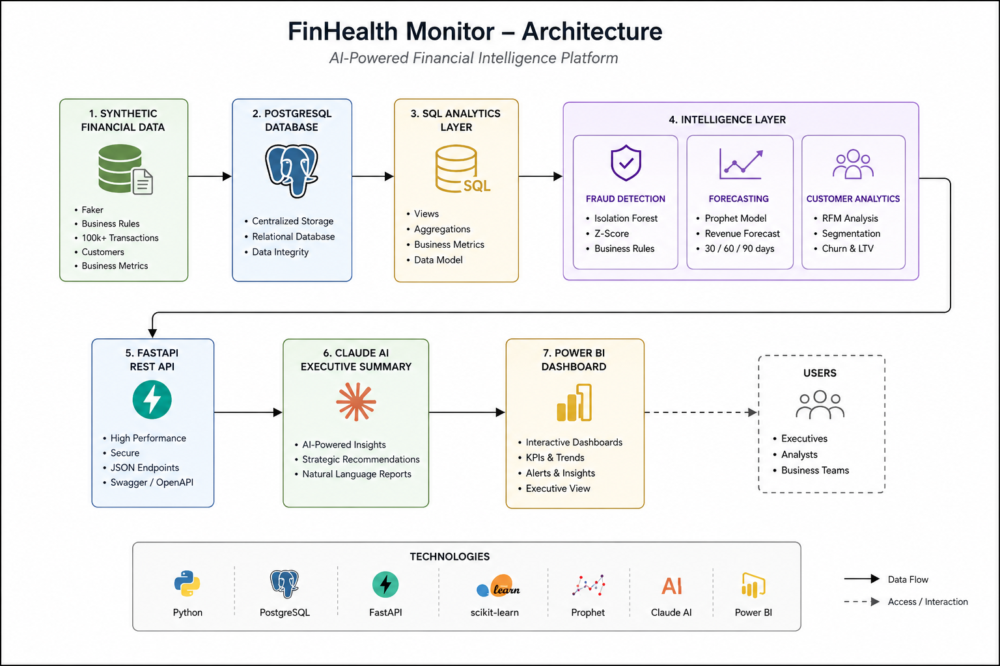

# FinHealth Monitor

**AI-powered Financial Intelligence Platform for Fraud Detection, Forecasting and Executive Decision Support**



## Live Demo

### REST API

https://finhealth-monitor-api.onrender.com

### Interactive Documentation (Swagger)

https://finhealth-monitor-api.onrender.com/docs

---

## Project Overview

FinHealth Monitor is an end-to-end financial intelligence platform that simulates how fintech companies monitor business performance, detect suspicious transactions, forecast future revenue and support executive decision-making through Machine Learning and Large Language Models.

Instead of analysing isolated metrics, the platform integrates Data Engineering, SQL Analytics, Machine Learning, Forecasting and AI-generated executive reporting into a unified financial monitoring pipeline.

---

## Project Highlights

- End-to-end financial intelligence platform
- Synthetic fintech transaction simulation
- PostgreSQL analytical database
- Fraud detection using business rules
- Anomaly detection using Isolation Forest
- Statistical anomaly detection using Z-Score
- Revenue forecasting with Prophet
- AI-generated executive reports using Claude AI
- REST API built with FastAPI
- Modular architecture designed for scalability

---

## Business Problem

Modern financial institutions process thousands of transactions every day.

Monitoring operational performance requires much more than tracking revenue. Risk teams must identify suspicious transactions, detect operational anomalies, understand customer behaviour and anticipate future trends before they become business problems.

Although these analyses often exist separately, executive teams need a unified platform capable of transforming raw financial data into actionable business insights.

FinHealth Monitor was developed to simulate this decision-support workflow.

---

## Solution

FinHealth Monitor combines multiple analytical components into a single financial intelligence platform.

The project integrates:

- SQL business analytics
- Machine Learning anomaly detection
- Revenue forecasting
- Fraud monitoring
- Customer analytics
- Executive reports generated by Claude AI
- FastAPI REST API

The objective is to simulate how financial institutions centralise operational intelligence and support executive decision-making.

---

## Architecture



---

## Current Features

- Synthetic financial dataset generation
- PostgreSQL relational database
- SQL analytical views
- Fraud detection rules
- Isolation Forest anomaly detection
- Z-Score anomaly detection
- Revenue forecasting using Prophet
- Executive summaries generated with Claude AI
- FastAPI REST API
- Modular Python architecture

---

## Technology Stack

| Category | Technologies |
|----------|--------------|
| Programming | Python |
| API | FastAPI |
| Database | PostgreSQL |
| ORM | SQLAlchemy |
| Data Analysis | Pandas, NumPy |
| Machine Learning | Scikit-learn |
| Forecasting | Prophet |
| Artificial Intelligence | Anthropic Claude |
| Visualisation | Power BI *(coming soon)* |

---

## Project Structure

```text
finhealth_monitor/
│
├── api/
├── data/
├── docs/
├── notebooks/
├── scripts/
├── sql/
├── README.md
├── requirements.txt
├── .env.example
└── .gitignore
```

---

## Machine Learning

### Fraud Detection

The project combines multiple approaches to identify suspicious financial behaviour:

- Business Rules
- Isolation Forest
- Statistical Z-Score Detection

Rather than replacing business rules, the objective is to demonstrate how unsupervised anomaly detection complements traditional fraud monitoring.

### Revenue Forecasting

Revenue forecasting is performed using Facebook Prophet, allowing future business performance projections and supporting strategic planning.

---

## AI Executive Reports

One of the main features of FinHealth Monitor is the integration with Anthropic Claude.

Instead of presenting only KPIs and charts, the platform automatically generates executive summaries that transform business metrics into actionable insights.

Each report includes:

- Executive Score
- Risk Level
- Business Performance
- Fraud Analysis
- Anomaly Analysis
- Customer Analysis
- Business Strengths
- Main Risks
- Executive Recommendations

---

## REST API

The analytical services are exposed through a FastAPI application.

### Main Endpoints

| Endpoint | Description |
|----------|-------------|
| `/overview` | Business overview metrics |
| `/customers` | Customer metrics |
| `/forecast` | Revenue forecast |
| `/anomalies` | Fraud and anomaly analysis |
| `/executive-summary` | AI-generated executive report |
| `/health` | API health check |

Interactive documentation is available through Swagger UI.

```
http://127.0.0.1:8000/docs
```

---

## Notebook

The complete data science workflow is documented in:

```
notebooks/01_model_evaluation.ipynb
```

The notebook includes:

- Exploratory Data Analysis
- Feature Engineering
- Isolation Forest
- Z-Score Detection
- Prophet Forecasting
- Model Evaluation
- Business Interpretation

---

## Dashboard
## Dashboard

🚧 An interactive Power BI dashboard is currently under development and will be included in the next release.

The dashboard will provide:

- Executive KPIs
- Revenue Monitoring
- Fraud Analytics
- Customer Analytics
- Forecast Visualisations

---

## Results

The project demonstrates a complete analytical workflow covering:

- Synthetic Data Generation
- Relational Database Design
- SQL Analytics
- Machine Learning
- Revenue Forecasting
- AI-generated Executive Reporting
- REST API Development

Rather than focusing on a single model or dashboard, FinHealth Monitor integrates multiple technologies into a unified financial intelligence platform.

---

## Future Improvements

- Interactive Power BI Dashboard
- Cloud Deployment
- Docker Support
- Authentication & User Management
- Automated Tests
- CI/CD Pipeline
- Real-time Data Streaming

---

## How to Run

Clone the repository:

```bash
git clone https://github.com/robertaNicolle/finhealth_monitor.git

cd finhealth_monitor
```

Create a virtual environment:

```bash
python -m venv .venv
```

Activate the environment:

### Windows

```bash
.venv\Scripts\activate
```

### Linux / macOS

```bash
source .venv/bin/activate
```

Install the dependencies:

```bash
pip install -r requirements.txt
```

Create the environment file:

```bash
cp .env.example .env
```

Configure your PostgreSQL credentials and Anthropic API key.

Run the API:

```bash
uvicorn api.main:app --reload
```

Access Swagger:

```
http://127.0.0.1:8000/docs
```

---

## Project Status

**Version:** 1.0

Current focus:

- Complete analytical pipeline
- Machine Learning
- REST API
- AI Executive Reporting

Next release:

- Interactive Power BI Dashboard
- Cloud Deployment
- CI/CD

---

## Author

**Roberta Soares**

Data Science • Machine Learning • Artificial Intelligence

GitHub

https://github.com/robertaNicolle

LinkedIn

https://linkedin.com/in/roberta-soares-dev